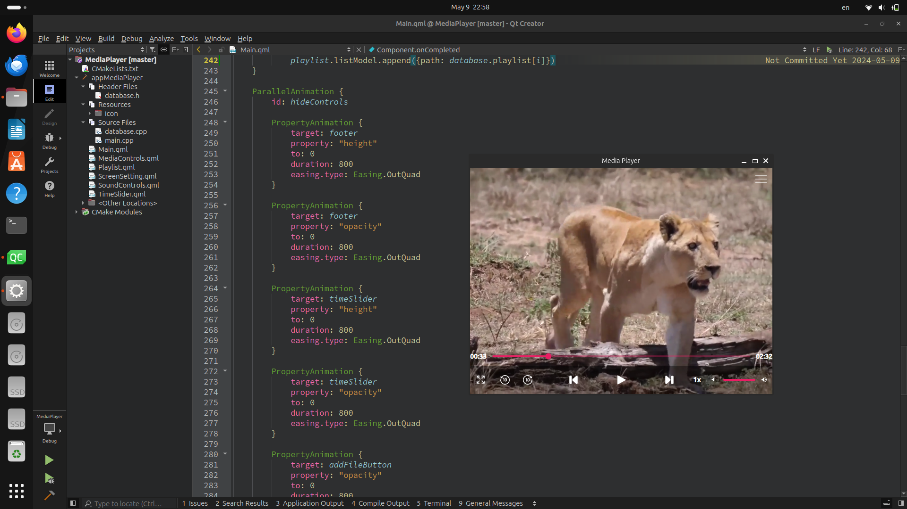
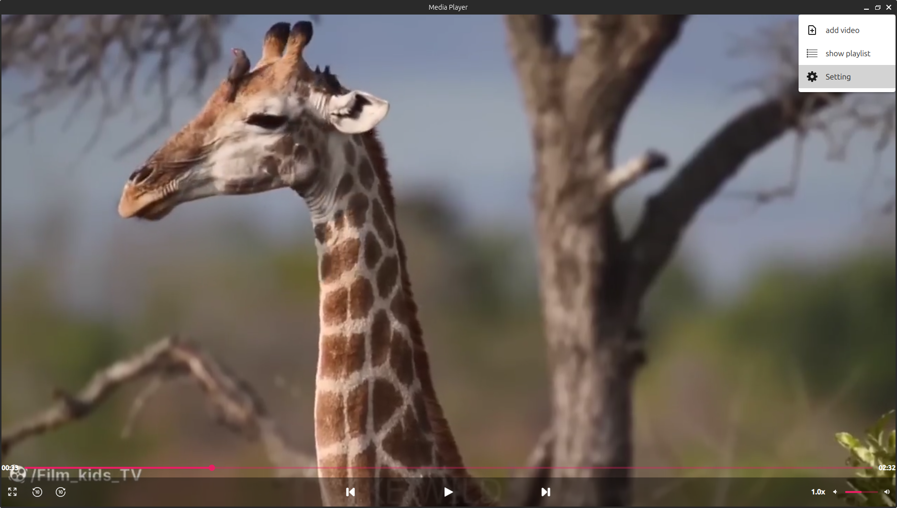
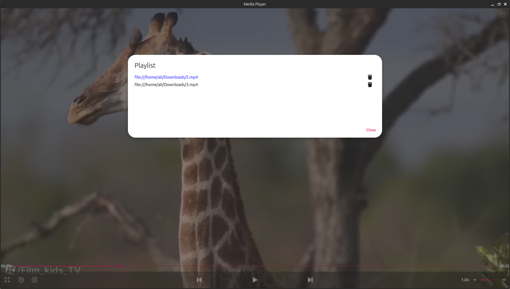

# Media Player

A simple Media player application using QML and C++.

## Description

This application is a basic media player built using QML and C++. It supports playback of video files with formats like mp4, avi, mkv, mov, wmv, and provides basic media controls such as play, pause, forward, and playback speed adjustment. It also includes features for managing playlists, adjusting volume, and user-friendly interface animations.

## Features

- Media playback with support for various video formats.
- Create database using C++ class
- Playlist management: Add and remove videos in the playlist and database.
- Playback controls: Play, pause, forward, and adjust playback speed.
- Volume control: Adjust volume and mute/unmute.
- User-friendly interface with animations.

## Screenshots

## Usage

1. **Adding a Video**:
   - Click on the "Add Video" menu.
   - Select a video file from the file dialog.
   - The video will be added to the playlist and start playing.

2. **Playback Controls**:
   - Use the replay button to jump back 10 seconds in the video.
   - Use the forward button to skip ahead 10 seconds in the video.
   - Adjust the playback speed by clicking on the speed control button.

3. **Volume Adjustment**:
   - Use the sound controls to adjust the volume.
   - Click on the sound icon to mute/unmute.

4. **Menu**:
   - Click on the menu icon to open the main menu.
   - From the menu, you can add new videos or show the playlist.

